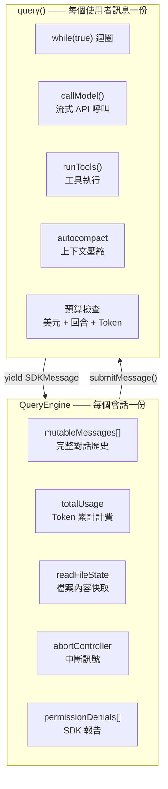
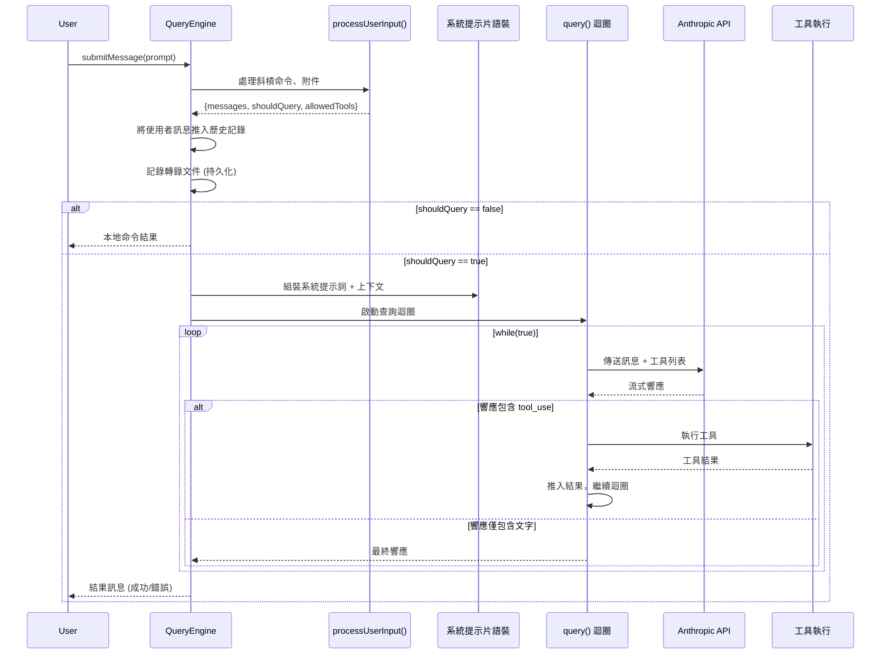

> 🌐 **語言**: [English →](../01-query-engine.md) | 中文

# 查詢引擎 (QueryEngine)：Claude Code 的大腦

> **原始檔**：`QueryEngine.ts` (1,296 行), `query.ts` (1,730 行), `query/` 目錄

## 太長不看，一句話總結

QueryEngine 是 Claude Code 整個生命週期的核心編排器。它負責擁有會話狀態、管理 LLM 查詢迴圈、處理流式傳輸、跟蹤成本，並協調從使用者輸入處理到工具執行的一切工作。`query()` 中的核心迴圈是一個刻意設計的簡單 `while(true)` 非同步生成器（AsyncGenerator） —— 所有的智慧都存在於 LLM 中，腳手架（Scaffold）被有意設計為“愚鈍”的。

---

## 1. 兩層架構：QueryEngine (會話級) + query() (回合級)

引擎被分為具有不同生命週期的兩層：



| 層級 | 生命週期 | 核心職責 |
|-------|----------|----------------|
| `QueryEngine` | 每個會話 (Conversation) | 會話狀態、訊息歷史、累計用量、檔案快取 |
| `query()` | 每個使用者訊息 (Turn) | API 迴圈、工具執行、自動壓縮、預算強制執行 |

---

## 2. submitMessage() 生命週期

每次呼叫 `submitMessage()` 都遵循一個精確的序列：



### 第一階段：輸入處理
`processUserInput()` 處理：
- **斜槓命令** (`/compact`, `/clear`, `/model` 等)
- **檔案附件** (圖片、文件)
- **輸入規範化** (內容塊與純文字的轉換)
- **工具白名單**

如果 `shouldQuery` 為 false（例如 `/clear`），結果將直接返回，而不呼叫 API。

### 第二階段：上下文組裝
系統提示詞從多個來源動態組裝，包括 CLAUDE.md、當前目錄資訊、已安裝技能以及外掛提供的上下文。

### 第三階段：query() 迴圈
核心迴圈是一個 `while(true)` 的非同步生成器，它處理與 LLM 的多輪互動。

---

## 3. query() 迴圈：1,730 行程式碼下的“混沌控制”

`query.ts` 中的 `query()` 函式是工具執行的心臟。儘管長達 1,730 行，其核心結構卻很簡單：

```
while (true) {
    1. 預處理：snip → microcompact → context collapse → autocompact (壓縮流水線)
    2. 呼叫 API：流式獲取響應
    3. 後處理：執行工具，處理錯誤
    4. 決策：繼續 (發現 tool_use) 或 終止 (end_turn)
}
```

### 預處理流水線
在每次 API 呼叫前，訊息會透過多級壓縮：
- **工具結果預算**：限制工具輸出的大小。
- **Snip (剪裁)**：移除陳舊的對話片段。
- **Microcompact (微壓縮)**：快取感知的檔案編輯記錄。
- **Context Collapse (上下文摺疊)**：歸檔舊的回合。
- **Autocompact (自動壓縮)**：當接近 Token 限制時進行全文摘要。

---

## 4. 狀態管理：訊息分發中心

在 `submitMessage()` 內部，一個大型 `switch` 語句負責路由每種訊息型別（assistant, user, progress, stream_event, system 等）。設計關鍵點：**每種訊息型別**都透過相同的 yield 管道分發，確保了通訊路徑的單一性和可靠性。

---

## 可遷移設計模式

> 以下來自 QueryEngine 的模式可直接應用於任何 LLM 互動編排系統。

### 模式 1：非同步生成器 (AsyncGenerator) 作為通訊協議
整個引擎透過 `yield` 進行通訊。沒有回撥，沒有事件觸發器。非同步生成器提供了背壓（Backpressure）控制和完美的取消機制（`.return()`）。

### 模式 2：帶有不可變快照的可變狀態
引擎維護一個可變的訊息陣列以實現跨回合持久化，但在每次查詢迴圈迭代時都會獲取不可變快照。

### 模式 3：透過閉包注入許可權限制
許可權跟蹤是透明注入的 —— 查詢迴圈並不知道自己正在被監控。

### 模式 4：基於水印的錯誤範圍界定
引擎透過儲存最後一次錯誤的水印（參考）來回溯錯誤，而不是透過計數器。這種方式在環形緩衝區滾動時依然有效。

---

## 6. 成本與 Token 追蹤：每一分錢都有跡可循

> 每次 API 呼叫都消耗真金白銀。成本追蹤系統是整個會話的財務賬本 —— 按模型累積費用，整合 OpenTelemetry，並在會話恢復時持久化還原。

// 原始碼位置: src/cost-tracker.ts:278-323

### 累積流程

每次 API 返回響應時，`addToTotalSessionCost()` 執行一套多步記賬流程：

```typescript
export function addToTotalSessionCost(cost, usage, model) {
  // 1. 更新按模型分組的用量 Map（輸入、輸出、快取讀寫 Token）
  const modelUsage = addToTotalModelUsage(cost, usage, model)
  // 2. 遞增全域性狀態計數器
  addToTotalCostState(cost, modelUsage, model)
  // 3. 推送到 OpenTelemetry 計數器（如已配置）
  getCostCounter()?.add(cost, attrs)
  getTokenCounter()?.add(usage.input_tokens, { ...attrs, type: 'input' })
  // 4. 遞迴計算顧問模型（Advisor）成本 —— 巢狀模型如 Haiku 分類器
  for (const advisorUsage of getAdvisorUsage(usage)) {
    totalCost += addToTotalSessionCost(advisorCost, advisorUsage, advisorUsage.model)
  }
  return totalCost
}
```

### 按模型用量對映

// 原始碼位置: src/cost-tracker.ts:250-276

系統以模型粒度進行追蹤。每個模型維護獨立的執行時統計，包含輸入 Token、輸出 Token、快取讀/寫 Token、Web 搜尋請求數、累計美元成本、上下文視窗大小和最大輸出限制。

### 會話持久化與恢復

// 原始碼位置: src/cost-tracker.ts:87-175

成本可以在會話恢復（`--resume`）時存活。儲存時所有累積狀態被寫入專案配置檔案；恢復時 `restoreCostStateForSession()` 重新載入計數器 —— 但**僅當會話 ID 匹配時**才執行，防止跨會話的成本汙染。

---

## 7. 錯誤恢復：優雅降級的藝術

> 查詢迴圈中的錯誤處理不是事後補丁 —— 它是 `query.ts` 中第二大的子系統。系統實現了多層重試與恢復架構，將瞬態故障變成無感的小插曲。

### withRetry 引擎

// 原始碼位置: src/services/api/withRetry.ts:170-517

`withRetry()` 是一個非同步生成器，為每次 API 呼叫套上精密的重試邏輯：

```
API 呼叫 → 出錯?
  ├── 429 (限流)      → 指數退避重試（基數 500ms，上限 32s）
  ├── 529 (過載)      → 前臺查詢重試；後臺查詢立即放棄
  ├── 401 (認證失敗)  → 重新整理 OAuth Token，清除 API 金鑰快取，重試
  ├── 403 (Token 撤銷) → 強制 Token 重新整理，重試
  ├── ECONNRESET/EPIPE → 禁用長連線，重新建連
  ├── 上下文溢位        → 計算安全 max_tokens，重試
  └── 其他 5xx         → 標準指數退避重試
```

### 前臺 vs 後臺：查詢的優先順序分層

// 原始碼位置: src/services/api/withRetry.ts:57-89

一個關鍵最佳化：**529 錯誤僅對前臺查詢重試**。後臺任務（摘要生成、標題提取、分類器）在 529 時立即放棄，避免在容量級聯故障中製造放大效應。

### 模型降級觸發

// 原始碼位置: src/services/api/withRetry.ts:327-364

連續 3 次 529 錯誤後，系統觸發 `FallbackTriggeredError`。查詢迴圈捕獲後執行：為孤立訊息生成墓碑標記 → 剝離 Thinking 簽名（簽名與模型繫結） → 用備用模型重試。

### 持久重試模式 (UNATTENDED_RETRY)

// 原始碼位置: src/services/api/withRetry.ts:91-104, 477-513

無人值守會話中，系統對 429/529 **無限重試**，退避上限 5 分鐘，將等待時間切分為 30 秒的心跳間隔。每次心跳 yield 一條 `SystemAPIErrorMessage`，防止宿主環境將會話標記為空閒。

### max_output_tokens 恢復（三級升級策略）

// 原始碼位置: src/query.ts:1188-1256

當模型觸及輸出 Token 上限時，迴圈按三級策略升級：
1. **升級到 64K Token**（一次性提升）
2. **注入恢復訊息**（最多 3 次）—— 明確告訴模型："不要道歉、不要回顧，直接從中斷處繼續。"
3. **恢復耗盡** → 將錯誤暴露給使用者

恢復訊息特意要求模型跳過寒暄與複述 —— 因為那些行為只會浪費更多 Token，讓問題雪上加霜。

---

---

## 8. 流式處理架構：繞過 O(n²) 陷阱

> Anthropic SDK 的 `BetaMessageStream` 與原始 SSE 流處理之間的選擇不是學術問題 —— 它是一道規模化場景下的效能懸崖。

// 原始碼位置: src/services/api/claude.ts:1266-1280

### 為什麼選擇原始 SSE 而非 SDK 流？

SDK 的 `BetaMessageStream` 在每個 delta 上重建整個訊息物件。對於一個 10,000 字元的響應，這意味著 O(n²) 級別的字串拼接。Claude Code 直接處理原始 SSE 流，使用增量狀態機：

1. `message_start` → 初始化訊息結構
2. `content_block_start` → 建立新 block（text / tool_use / thinking）
3. `content_block_delta` → 僅追加 delta 文字（每次 O(1)）
4. `content_block_stop` → 完成 block
5. `message_stop` → 完成訊息，提取 usage 統計

### 流空閒看門狗

90 秒無資料的流會被自動中止，防止系統在僵死連線上無限吊著。中止後透過 `withRetry` 自動重試。

---

## 9. 上下文收集：Claude 對你的開發世界瞭解多少

> 在任何 API 呼叫之前，系統會組裝出使用者環境的豐富畫像。這些上下文被 memoize 快取、在空閒視窗預取、並透過安全門控防止執行不可信程式碼。

// 原始碼位置: src/context.ts:116-189

### 兩個上下文源

| 來源 | 函式 | 內容 |
|--------|----------|----------|
| **系統上下文** | `getSystemContext()` | Git 狀態、分支、最近日誌、使用者名稱 |
| **使用者上下文** | `getUserContext()` | CLAUDE.md 檔案、當前日期 |

### Git 狀態：並行採集

// 原始碼位置: src/context.ts:60-110

Git 後設資料透過 `Promise.all()` 並行獲取（分支、預設分支、status、log、使用者名稱）。關鍵細節：`--no-optional-locks` 標誌防止 git 獲取索引鎖，避免與使用者的並行 git 操作衝突。Status 輸出截斷為 2,000 字元 —— 有數百個變更檔案的髒倉庫不應該炸掉上下文視窗。

### Memoize + 手動失效

兩個上下文函式使用 lodash `memoize()` 實現"首次計算、永久快取"。當底層資料變化時（如系統提示注入），透過 `cache.clear()` 手動失效。

### 安全優先的預取

// 原始碼位置: src/main.tsx:360-380

Git 命令可以透過 `core.fsmonitor` 和 `diff.external` 鉤子執行任意程式碼。系統**僅在信任建立之後**才預取 git 上下文，在不受信任的目錄中預取 git status 等於允許攻擊者執行程式碼。

---

## 10. 訊息規範化：看不見的翻譯官

> 內部訊息格式與 API 線上格式不是同一個東西。`normalizeMessagesForAPI()` 在兩者之間架起橋樑 —— 合併、過濾、變換訊息為 API 期望的格式，同時保護 Prompt Cache 的完整性。

// 原始碼位置: src/utils/messages.ts:1989+

### 規範化做了什麼

```
內部訊息 → normalizeMessagesForAPI() → API 就緒訊息
  - 合併連續同角色訊息
  - 過濾 progress / system / tombstone 訊息
  - 按 ToolSearch 最佳化剝離延遲工具 schema
  - 規範化工具輸入格式
  - 處理 thinking block 位置約束
```

### 不可變訊息原則

// 原始碼位置: src/query.ts:747-787

傳送給 API 的訊息在跨輪次時必須保持位元組級一致 —— 任何變化都會使 Prompt Cache 失效。系統透過"yield 前克隆"來強制執行：僅當 backfill 新增了**新欄位**（而非覆蓋已有欄位）時才克隆訊息。

### Thinking Block 約束

API 對 thinking block 強制執行三條嚴格規則：

| 規則 | 約束 | 違反後果 |
|------|-----------|---------|
| **需要預算** | 包含 thinking block 的訊息必須在 `max_thinking_length > 0` 的查詢中 | 400 錯誤 |
| **不能在末尾** | thinking block 不能是訊息中的最後一個 block | 400 錯誤 |
| **跨工具呼叫保持** | thinking block 必須在助手的 trace 中持續保留 —— 跨越 tool_use/tool_result 邊界 | 靜默損壞 |

正如原始碼註釋所說：_"不遵守這些規則的懲罰：一整天的除錯和揪頭髮。"_

---

## 13. CLI 引導：從二進位制到查詢迴圈

**原始碼座標**: `src/entrypoints/cli.tsx`（303 行，39KB）

在 `QueryEngine` 執行之前，CLI 入口先決定**執行什麼**。這不是一個簡單的引數解析器 —— 而是一個為啟動延遲最佳化的**多路徑分發器**。

### 快速路徑架構

共 12+ 個快速路徑，每個路徑透過 `feature()` 門控 + 動態 `await import()` 實現按需載入：

| 快速路徑 | 觸發條件 | 載入模組 |
|---------|---------|---------|
| `--version` | 首引數匹配 | **零匯入**，直接列印 `MACRO.VERSION` |
| `--dump-system-prompt` | 內部專用 | 僅載入 config + model + prompts |
| `remote-control`/`bridge` | 子命令 | Bridge 全棧（OAuth + 策略檢查） |
| `daemon` | 子命令 | 守護程序主迴圈 |
| `ps`/`logs`/`attach`/`--bg` | 子命令或標誌 | 後臺會話管理 |
| `--worktree --tmux` | 組合標誌 | tmux worktree 快速 exec |
| 預設 | 無特殊標誌 | **完整 CLI → cliMain() → QueryEngine** |

### 三個設計原則

1. **動態 `import()` 無處不在**：每個快速路徑用 `await import()` 代替頂層匯入。`--version` 路徑**零模組匯入**。
2. **`feature()` 門控消除死程式碼**：構建時 Bun 打包器消除禁用特性的整個程式碼塊，外部構建永遠不含 `ABLATION_BASELINE` 等內部路徑。
3. **`profileCheckpoint()` 啟動檢測**：每個路徑記錄檢查點，精確測量所有入口向量的啟動延遲。

### Ablation Baseline 彩蛋

```typescript
// 必須在此處而非 init.ts，因為 BashTool/AgentTool 在模組匯入時
// 就將環境變數捕獲為常量 —— init() 執行時已太晚
if (feature('ABLATION_BASELINE') && process.env.CLAUDE_CODE_ABLATION_BASELINE) {
  // 關閉：thinking、compact、auto-memory、background tasks
  // 測量純 LLM 基線效能
}
```

---

## 總結

| 維度 | 細節 |
|--------|--------|
| **QueryEngine** | 1,296 行，負責單個會話生命週期，管理歷史與用量 |
| **query()** | 1,730 行，單回合 `while(true)` 迴圈，負責工具執行 |
| **通訊方式** | 純非同步生成器 —— 無回撥，無事件分發 |
| **預處理** | 5 級壓縮流水線 (預算 → 剪裁 → 微壓縮 → 摺疊 → 自動壓縮) |
| **預算限制** | 美元、回合、Token —— 全都在迴圈中強制執行 |
| **錯誤恢復** | withRetry (429/529/401 矩陣)、模型降級、輸出上限三級升級、持久重試 |
| **成本追蹤** | 按模型 `addToTotalSessionCost()`、OpenTelemetry 計數器、會話級持久化 |
| **流式處理** | 原始 SSE 取代 SDK 流（規避 O(n²)）、90 秒空閒看門狗 |
| **上下文** | Memoized Git 並行採集、安全門控預取、2K 狀態截斷 |
| **訊息** | `normalizeMessagesForAPI()` —— 不可變原件、yield 前克隆、thinking block 規則 |
| **關鍵原則** | "愚鈍的腳手架，聰明的模型" —— 迴圈必須保持簡單，複雜邏輯留給 LLM |

