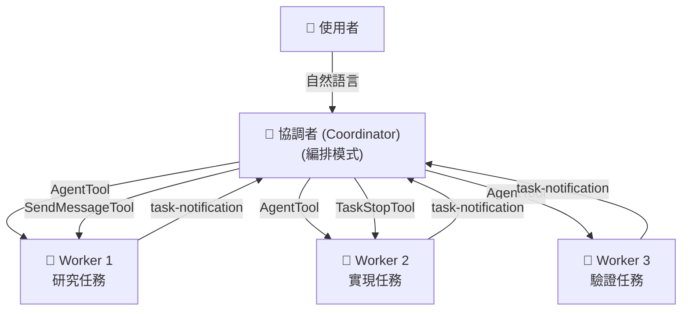

> 🌐 **語言**: [English →](../03-coordinator.md) | 中文

# 多智慧體協調器 (Coordinator)：Claude Code 如何編排並行工作執行緒

> **原始檔**：`coordinator/coordinatorMode.ts` (370 行), `tools/AgentTool/` (14 個檔案), `tools/SendMessageTool/`, `tools/TeamCreateTool/`, `tools/TeamDeleteTool/`, `tools/TaskStopTool/`

## 太長不看，一句話總結

Claude Code 不僅僅是一個單智慧體（Single-agent）的命令列工具。它擁有一個隱藏的**協調者模式 (Coordinator mode)**，可以將其轉化為一個多智慧體編排器 —— 負責分發並行工作智慧體、在它們之間路由訊息並彙總結果。這一功能被隱藏在編譯時標誌之後，在官方文件中並無提及。

---

## 1. 兩種模式

Claude Code 執行在兩種模式之一，由 `bun:bundle` 特性標誌控制：

| 模式 | 行為 |
|------|----------|
| **Normal (普通模式)** | 具有完整工具訪問許可權的單個智慧體 —— 標準的 CLI 體驗。 |
| **Coordinator (協調者模式)** | 充當編排器，分發 Worker，本身無法直接使用檔案或 Bash 工具。 |

模式在啟動時由編譯標誌 `COORDINATOR_MODE`（編譯期開關）和環境變數 `CLAUDE_CODE_COORDINATOR_MODE`（執行期開關）共同決定。

---

## 2. 架構：協調者與工作執行緒 (Worker)



### 核心原則：完全的上下文隔離
**Worker 無法看到協調者的對話歷史。** 每個 Worker 啟動時都是零上下文的。協調者必須編寫自包含的 Prompt，包括 Worker 所需的一切：檔案路徑、行號、錯誤資訊以及“完成”的標準。

這種隔離是架構層面強制執行的，而非僅僅是約定。

### 協調者的工具箱
在協調者模式下，智慧體的工具集受到嚴格限制：
- `AgentTool`：產生新的 Worker。
- `SendMessageTool`：向現有 Worker 傳送後續指令。
- `TaskStopTool`：終止正在執行的 Worker。
協調者會將所有“髒活累活”（Bash、讀寫檔案）委託給 Worker。

---

## 3. Worker 生命週期

### 3.1 產生 Worker
Worker 透過 `AgentTool` 產生。每個 Worker 都是一個擁有獨立工具集的子程序。
根據是否開啟 `Simple` 模式，Worker 會獲得核心的檔案操作權或全量的標準工具權。

### 3.2 XML 通知機制
當 Worker 執行完畢時，結果會透過帶有 XML 標籤的“使用者角色訊息”傳遞給協調者：
```xml
<!-- 原始碼位置: src/coordinator/coordinatorMode.ts:180-192 -->
<task-notification>
  <task-id>{agentId}</task-id>
  <status>completed|failed|killed</status>
  <summary>{狀態摘要}</summary>
  <result>{Worker 的最終文字響應}</result>
</task-notification>
```
這種設計非常優雅：通知看起來像使用者訊息，但透過自定義標籤讓協調者能夠識別並無縫處理。

### 3.3 Worker 的延續與終止
協調者可以根據上下文決定是讓 Worker “繼續執行”新指令，還是銷燬它併產生一個“全新（Fresh）”的 Worker：
- **研究任務**：通常延續，因為 Worker 已經載入了相關檔案。
- **驗證任務**：通常產生全新 Worker，以確保獨立性和“旁觀者清”。

---

## 4. 協調者的工作流模型

系統提示詞定義了一個經典的四階段工作流：
1. **研究 (Research)**：並行分發 Worker 調研程式碼庫。
2. **綜合 (Synthesis)**：協調者讀取調研結果，理解問題並制定具體的規範（禁止模稜兩可）。
3. **實現 (Implementation)**：Worker 根據綜合規範進行程式碼修改。
4. **驗證 (Verification)**：產生全新的 Worker 進行獨立驗證。

---

## 5. 暫存區 (Scratchpad)：跨 Worker 的共享狀態

雖然 Worker 之間是隔離的，但它們需要共享資料。解決方案是一個 **Scratchpad 目錄**：
- 這是一個所有 Worker 都可以讀寫的特定目錄。
- 在該目錄下的操作**不需要使用者確認**。
- 這為多智慧體協作提供了持久化的知識中轉站。

---

## 6. Fork 機制：上下文共享最佳化

除了標準 Worker 之外，還存在一種 **Fork (派生)** 機制：
- **普通 Worker**：零上下文，冷啟動。
- **Fork**：整合父級的完整對話上下文和 Prompt 快取。
Fork 是一種效能最佳化手段，旨在節省 Token 並複用父級的思考過程，適用於需要深入理解當前上下文的研究任務。

---

## 可遷移設計模式

> 以下模式可直接應用於其他多智慧體編排系統。

### 模式 1：編譯時特性門控
**場景：** 部分功能僅面向特定使用者群體，需要在構建時隔離程式碼路徑。
**實踐：** 使用 `feature()` 編譯標誌 + 打包器死程式碼消除，未啟用功能整個模組從二進位制中移除。
**Claude Code 中的應用：** `feature('COORDINATOR_MODE')` 為 false 時，整個協調器模組在打包階段被剔除。

### 模式 2：XML 通知嵌入使用者訊息
**場景：** 非同步子任務完成後需要將結果注入到主對話流中。
**實踐：** 將結構化資料包裝為 XML 標籤嵌入使用者角色訊息，LLM 自然理解其語義，無需專用訊息通道。
**Claude Code 中的應用：** Worker 完成後的 `<task-notification>` 以使用者訊息形式傳送給協調者。

### 模式 3：架構級上下文隔離
**場景：** 多個並行智慧體可能互相"汙染"上下文，導致推理質量下降。
**實踐：** 每個 Worker 作為獨立子程序啟動，從零上下文開始，強制協調者編寫自包含 Prompt。
**Claude Code 中的應用：** Worker 不繼承父級對話歷史，協調者必須顯式傳遞所有必要資訊。

### 模式 4：綜合作為一等公民
**場景：** 多層委託中指令在傳遞過程中容易退化。
**實踐：** 在系統提示詞中明確要求協調者親自完成理解和綜合，禁止向 Worker 推卸理解責任。
**Claude Code 中的應用：** 協調者 Prompt 中明確禁止使用 "based on your findings" 等推卸用語。

---

## 8. 總結

| 維度 | 細節 |
|--------|--------|
| **啟用方式** | `COORDINATOR_MODE` 構建標誌 + 環境變數 |
| **工具受限** | 協調者無法直接訪問 Bash/檔案，只能排程 |
| **隔離性** | Worker 之間、Worker 與協調者之間完全上下文隔離 |
| **通訊協議** | 使用者角色訊息中的 XML `<task-notification>` |
| **共享狀態** | 透過 Scratchpad 目錄實現跨智慧體知識傳遞 |
| **工作流** | 研究 → 綜合 → 實現 → 驗證 |
| **核心信條** | “永遠不要委託‘理解’過程” —— 協調者負責思考，Worker 負責執行 |
