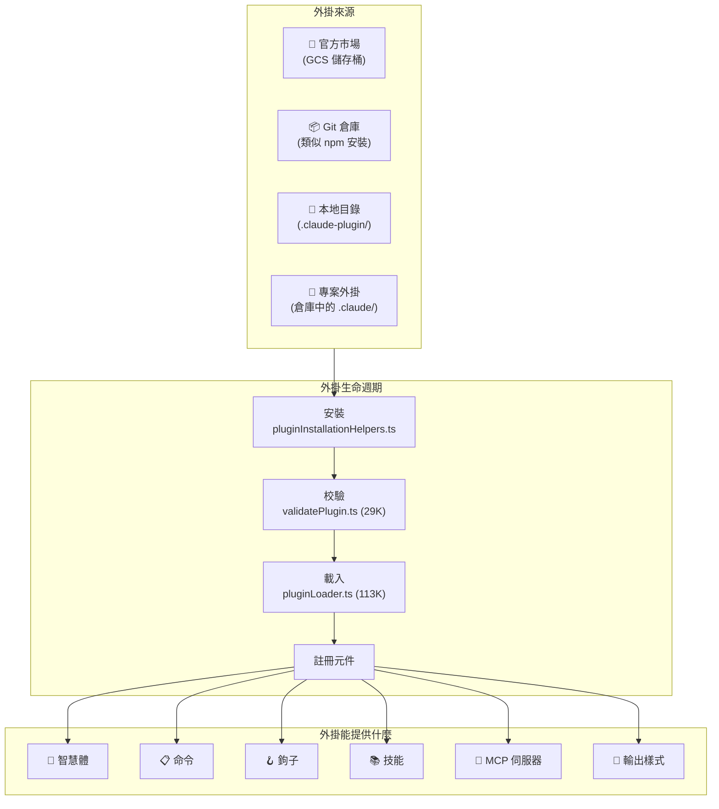

> 🌐 **語言**: [English →](../04-plugin-system.md) | 中文

# 外掛系統：44 個檔案，全生命週期管理

> **原始檔**：`utils/plugins/` (44 個檔案, 18,856 行), `components/ManagePlugins.tsx` (2,089 行)

## 太長不看，一句話總結

Claude Code 在底層隱藏了一個完整的外掛生態系統 —— 包括外掛市場、依賴解析、自動更新、黑名單、ZIP 快取和熱過載。它比官方文件所暗示的要複雜得多。單單是外掛載入器 (`pluginLoader.ts`) 就有 113K 位元組 —— 比大多數完整的 npm 包還要大。

---

## 1. 外掛架構概覽



---

## 2. 外掛清單 (Manifest)

每個外掛都必須有一個 `.claude-plugin/plugin.json` 清單：

```typescript
// 來自 schemas.ts (60K —— 程式碼庫中最大的 schema 檔案)
{
  "name": "my-plugin",
  "description": "這個外掛做什麼的描述",
  "version": "1.0.0",
  "commands": ["commands/*.md"],
  "agents": ["agents/*.md"],
  "hooks": { ... },
  "mcpServers": { ... },
  "skills": ["skills/*/SKILL.md"],
  "outputStyle": "styles/custom.md"
}
```

`schemas.ts` 中的 Schema 校驗程式碼長達 **60,595 位元組** —— 比大多數完整的外掛還要大。它會校驗從命令列 Frontmatter 到 MCP 伺服器配置的一切內容。

---

## 3. 外掛系統核心檔案

| 檔案 | 大小 | 用途 |
|------|------|---------|
| **`pluginLoader.ts`** | **113K** | 核心載入器 —— 發現、讀取、校驗並註冊所有外掛 |
| **`marketplaceManager.ts`** | **96K** | 外掛市場瀏覽、搜尋及從官方目錄安裝 |
| **`schemas.ts`** | **61K** | 適用於所有外掛清單格式的 Zod 校驗 Schema |
| **`installedPluginsManager.ts`** | **43K** | 管理已安裝外掛的狀態、啟用和停用 |
| **`loadPluginCommands.ts`** | **31K** | 解析帶有 YAML Frontmatter 的 Markdown 命令檔案 |
| **`mcpbHandler.ts`** | **32K** | 橋接處理器，用於處理外掛提供的 MCP 伺服器 |
| **`validatePlugin.ts`** | **29K** | 外掛啟用前的多重校驗 |
| **`pluginInstallationHelpers.ts`** | **21K** | Git 克隆、npm 安裝、依賴解析 |
| **`mcpPluginIntegration.ts`** | **21K** | 將外掛宣告的 MCP 伺服器整合到工具池中 |
| **`marketplaceHelpers.ts`** | **19K** | 市場操作的輔助函式 |
| **`dependencyResolver.ts`** | **12K** | 解析外掛的依賴圖 |
| **`zipCache.ts`** | **14K** | 將下載的外掛快取為 ZIP 檔案以便離線使用 |

---

## 4. 外掛生命週期

### 4.1 發現
外掛從多個位置被發現，優先順序依次為：
1. **內建外掛** —— 與二進位制檔案捆綁在一起。
2. **專案外掛** —— 專案中的 `.claude/` 目錄。
3. **使用者外掛** —— `~/.config/claude-code/plugins/` 目錄。
4. **市場外掛** —— 官方的 GCS 儲存桶目錄。

### 4.2 安裝

從解析市場輸入到解析依賴，再到克隆/下載 ZIP，最終落庫到 `installedPlugins.json`，形成了一條嚴密的安裝鏈路。

### 4.3 校驗

`validatePlugin.ts` (29K) 會執行廣泛的檢查：
- 清單 Schema 校驗 (Zod)
- 命令檔案語法校驗
- 鉤子命令安全性檢查
- MCP 伺服器配置校驗
- 迴圈依賴檢測
- 版本相容性檢查

### 4.4 載入

作為程式碼庫中第二大的檔案，`pluginLoader.ts` (113K) 處理：
- 並行載入所有外掛元件
- 鉤子註冊與智慧體定義合併
- 帶有去重功能的命令註冊
- 啟動 MCP 伺服器並註冊技能目錄
- **錯誤隔離**（一個外掛崩潰不會影響其他外掛）

---

## 5. 市場系統

### 官方市場 
市場是一個服務於外掛目錄的 GCS (Google Cloud Storage) 儲存桶。它包含：
- **啟動檢查**：在啟動時檢查外掛更新。
- **自動更新**：後臺的自動更新機制。
- **黑名單**：可遠端禁用被攻破或違規的外掛。
- **安裝統計**：用於評估市場受歡迎程度的監控。

### ZIP 快取系統
下載的外掛被快取為 ZIP 檔案，以避免重複下載，並支援離線使用。使用內容雜湊作為鍵，實現跨版本和使用者的去重。

---

## 6. 外掛能提供什麼

- **智慧體 (Agents)**：透過 Markdown 檔案定義，可作為子智慧體呼叫。
- **命令 (Commands)**：透過帶有 YAML Frontmatter 的 Markdown 定義斜槓命令（例如 `/review-pr`）。
- **鉤子 (Hooks)**：註冊生命週期事件（PreToolUse / PostToolUse）。
- **MCP 伺服器**：宣告自動啟動的外部資源和工具伺服器。
- **技能 (Skills)**：自動發現帶有匹配模式的技能。
- **輸出樣式 (Styles)**：定製化輸出格式（例如講解模式、學習模式）。

---

## 7. 安全與信任模型

- **外掛策略**：來自不受信任來源的外掛需要使用者明確批准。官方市場的“受管（Managed）”外掛享有更高的信任級別。
- **黑名單**：遠端黑名單可透過 ID 停用外掛，每次啟動和載入外掛時都會檢查。
- **孤兒外掛過濾**：檢測並攔截源倉庫已被刪除的外掛，防止懸空引用。

---

## 8. Skill 系統架構

**原始碼座標**: `src/skills/`、`src/commands/`

Skill 是 Claude Code 的"提示即程式碼"系統 —— 每個 Skill 都是一個帶 YAML frontmatter 的 Markdown 檔案，定義了能力何時以及如何被啟用。

### 8.1 六層來源

```typescript
export type LoadedFrom =
  | 'commands_DEPRECATED'  // 遺留 commands/ 目錄（遷移路徑）
  | 'skills'               // .claude/skills/ 目錄
  | 'plugin'               // 透過外掛安裝
  | 'managed'              // 企業管控配置
  | 'bundled'              // CLI 內建 Skill
  | 'mcp'                  // 執行時從 MCP 伺服器發現
```

### 8.2 Skill Frontmatter

每個 Skill 透過 YAML frontmatter 解析，支援以下欄位：`displayName`、`description`、`allowedTools`（限制可用工具）、`whenToUse`（模型觸發條件）、`executionContext`（`fork` = 隔離執行）、`agent`（繫結到特定代理型別）、`effort`（推理力度等級）等。

### 8.3 內建 Skill 註冊

啟動時程式化註冊：`/update-config`、`/keybindings`、`/verify`、`/debug`、`/simplify`、`/batch`、`/stuck`。功能門控的特殊 Skill：`/loop`（需 `AGENT_TRIGGERS`）、`/claude-api`（需 `BUILDING_CLAUDE_APPS`）。

### 8.4 Inline vs Fork 執行上下文

| 上下文 | 行為 | 用例 |
|--------|------|------|
| **inline** | 注入提示到當前對話 | 簡單命令、配置變更 |
| **fork** | 在隔離子代理中執行，獨立 token 預算 | 複雜任務、多步操作 |

Fork 執行建立獨立查詢迴圈和訊息歷史，防止 Skill 執行汙染主對話上下文。

### 8.5 Token 預算管理

Skill 列表佔用約 1% 的上下文視窗。三級降級策略：1) 嘗試完整描述；2) 超預算時內建 Skill 保留完整描述，其他截斷；3) 極端情況僅顯示名稱。

### 8.6 內建 Skill 檔案安全

使用 `O_NOFOLLOW | O_EXCL` 防止符號連結攻擊，路徑遍歷驗證阻止 `..` 逃逸。

---

## 9. 內建外掛註冊

**原始碼座標**: `src/plugins/`

每個內建外掛是 skills + hooks + MCP 伺服器的**三元組**。`isAvailable` 函式支援環境感知啟用（如 JetBrains 專用外掛僅在檢測到 JetBrains IDE 時啟用）。

啟用/禁用邏輯：顯式使用者設定 > `defaultEnabled` > 預設啟用。

外掛提供的 Skill 自動轉換為斜槓命令：`getBuiltinPluginSkillCommands()` 遍歷所有已啟用外掛，呼叫 `skillDefinitionToCommand()` 生成 Command 物件。

---

## 10. MCP 整合深化

**原始碼座標**: `src/services/mcp/client.ts`

### 六種傳輸型別

| 傳輸 | 協議 | 用例 |
|------|------|------|
| `stdio` | stdin/stdout | 本地 CLI 工具 |
| `sse` | Server-Sent Events | 遠端 HTTP 伺服器 |
| `http` | HTTP POST（可流式） | 無狀態 API 伺服器 |
| `ws` | WebSocket | 雙向流式 |
| `sdk` | 程序內 SDK | 同程序工具 |
| `sse-ide` | SSE 透過 IDE 代理 | IDE 橋接伺服器 |

### 工具發現 → 工具物件轉換

MCP 工具命名規則：`mcp__{serverName}__{toolName}`，自動注入 `assembleToolPool()` 中並保持穩定排序。

---

## 11. 後臺安裝管理器

**原始碼座標**: `src/utils/plugins/pluginInstallationManager.ts`

採用**宣告式協調模型**：不是命令式的"安裝這個"，而是宣告"這些外掛應該存在"，管理器處理差異（安裝缺失、清理多餘、更新過期）。

關鍵設計：
- 每個安裝步驟發射進度事件，被 ManagePlugins UI 消費
- 一個外掛安裝失敗不阻塞其他外掛

---

## 可遷移設計模式

> 以下來自外掛系統的模式可直接應用於任何可擴充套件應用架構。

### 模式 1：預設隔離
每個外掛隔離載入，一個崩潰不影響其他。

### 模式 2：帶優先順序的多源發現
專案級別的外掛覆蓋使用者級別。

### 模式 3：內容定址快取
ZIP 快取使用內容雜湊作為鍵，支援跨版本去重。

### 模式 4：提示即程式碼 (Skills)
Markdown + YAML frontmatter = 可版本控制、可共享、可組合的能力。

### 模式 5：宣告式協調
`PluginInstallationManager` 借鑑 Kubernetes Operator 的"期望狀態 → 實際狀態 → 差異 → 協調"模型，比命令式安裝/解除安裝序列更健壯。

---

## 總結

| 維度 | 細節 |
|--------|--------|
| **總程式碼量** | 僅 `utils/plugins/` 目錄下就包含 44 個檔案，18,856 行 |
| **最大檔案** | `pluginLoader.ts` (113K), `marketplaceManager.ts` (96K) |
| **外掛來源** | 內建、專案內、使用者配置、官方市場 (GCS) |
| **提供元件** | 智慧體、命令、鉤子、技能、MCP 伺服器、輸出樣式 |
| **市場機制** | GCS 儲存桶目錄、自動更新、黑名單、安裝統計 |
| **安全機制** | 工作區信任、強制校驗、遠端黑名單、孤兒檢測 |
