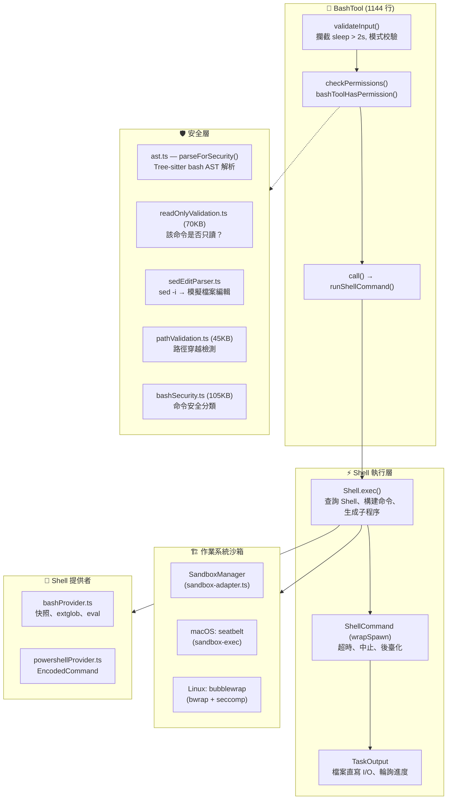
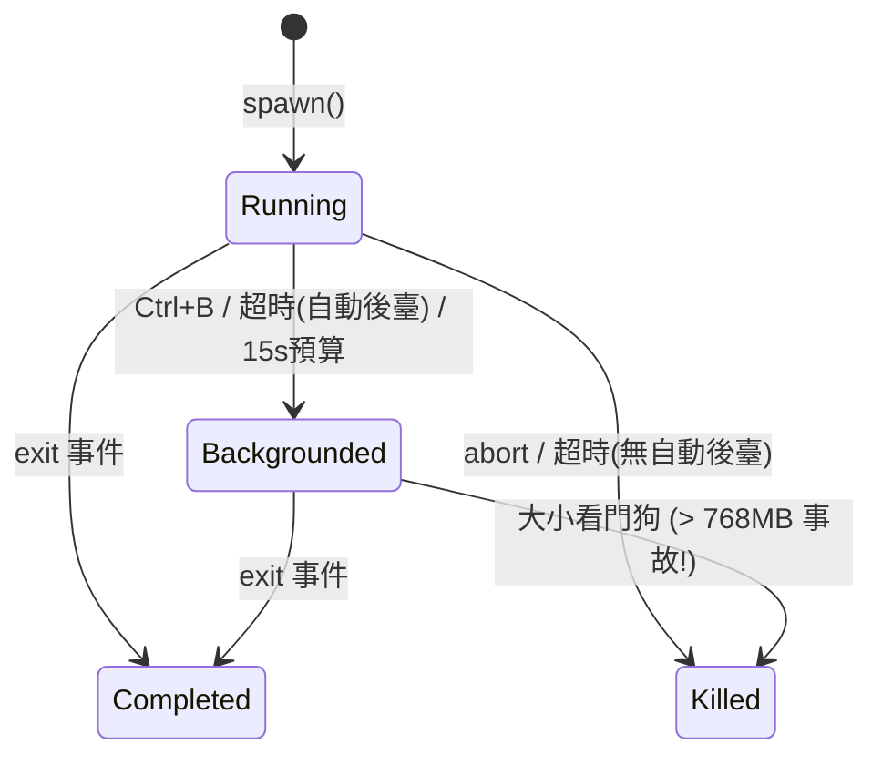
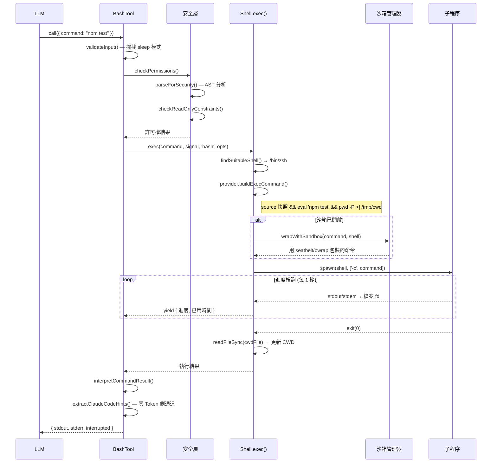

# 06 — Bash 執行引擎：沙箱、管道與程序生命週期

> **範圍**: `tools/BashTool/` (18 個檔案, ~580KB), `utils/Shell.ts`, `utils/ShellCommand.ts`, `utils/bash/` (15 個檔案, ~430KB), `utils/sandbox/` (2 個檔案, ~37KB), `utils/shell/` (10 個檔案, ~114KB)
>
> **一句話概括**: Claude Code 如何安全地執行任意 Shell 命令 —— 從解析 `ls && rm -rf /` 到作業系統級沙箱 —— 全程不慌不忙。

---

## 架構概覽



---

## 1. BashTool：外殼（雙關語）

入口點是 `BashTool.tsx` —— 一個 1144 行的工具定義，使用標準的 `buildTool()` 模式構建。輸入模式看似簡單：

```typescript
// 原始碼位置: src/tools/BashTool/BashTool.tsx:45-54
z.strictObject({
  command: z.string(),
  timeout: semanticNumber(z.number().optional()),
  description: z.string().optional(),
  run_in_background: semanticBoolean(z.boolean().optional()),
  dangerouslyDisableSandbox: semanticBoolean(z.boolean().optional()),
  _simulatedSedEdit: z.object({...}).optional()  // 對模型隱藏
})
```

### 隱藏的 `_simulatedSedEdit` 欄位

這是一個安全關鍵的設計：`_simulatedSedEdit` **始終從模型可見的 schema 中移除**。它僅在使用者透過許可權對話方塊批准 sed 編輯預覽後內部設定。如果暴露給模型，模型就能透過將一個無害命令與任意檔案寫入配對來繞過許可權檢查。

### 命令分類

在任何命令執行之前，BashTool 會對其進行 UI 分類：

- **搜尋命令** (`find`, `grep`, `rg` 等) → 可摺疊顯示
- **讀取命令** (`cat`, `head`, `tail`, `jq`, `awk` 等) → 可摺疊顯示
- **語義中性命令** (`echo`, `printf`, `true` 等) → 分類時跳過
- **靜默命令** (`mv`, `cp`, `rm`, `mkdir` 等) → 顯示 "Done" 而非 "(No output)"

對於複合命令（`ls && echo "---" && ls dir2`），**所有**部分都必須是搜尋/讀取操作，整個命令才會被摺疊。語義中性命令是透明的。

---

## 2. `runShellCommand()` 生成器

執行的核心是一個 **AsyncGenerator** —— 一種優雅地將進度報告與命令完成統一起來的設計：

```typescript
// 原始碼位置: src/tools/BashTool/BashTool.tsx:200-280
async function* runShellCommand({...}): AsyncGenerator<進度, 結果, void> {
  // 1. 判斷是否允許自動後臺化
  // 2. 透過 Shell.exec() 執行
  // 3. 等待初始閾值（2秒）後才顯示進度
  // 4. 由共享輪詢器驅動的進度迴圈
  while (true) {
    const result = await Promise.race([結果Promise, 進度訊號])
    if (result !== null) return result
    if (已後臺化) return 後臺化結果
    yield { type: 'progress', output, elapsedTimeSeconds, ... }
  }
}
```

### 三條後臺化路徑

| 路徑 | 觸發條件 | 決策者 |
|------|---------|--------|
| **顯式** | `run_in_background: true` | 模型 |
| **超時** | 命令超過預設超時時間 | `shellCommand.onTimeout()` |
| **助手模式** | 主代理中阻塞 > 15 秒 | `setTimeout()` + 15秒預算 |
| **使用者** | 執行期間按 Ctrl+B | `registerForeground()` → `background()` |

`sleep` 命令被特別禁止自動後臺化 —— 除非顯式請求，否則在前臺執行。

---

## 3. Shell 執行層 (`Shell.ts`)

### Shell 發現

Claude Code 對支援哪些 Shell 有明確立場：

```typescript
// 1. 檢查 CLAUDE_CODE_SHELL 覆蓋（必須是 bash 或 zsh）
// 2. 檢查 $SHELL（必須是 bash 或 zsh）
// 3. 探測：which zsh, which bash
// 4. 搜尋備用路徑：/bin, /usr/bin, /usr/local/bin, /opt/homebrew/bin
```

**僅支援 bash 和 zsh**。Fish、dash、csh —— 全部拒絕。

### 程序生成：檔案模式 vs. 管道模式

一個關鍵的架構決策驅動 I/O 效能：

**檔案模式（bash 命令預設）**：stdout 和 stderr **共用同一個檔案描述符**。這意味著 stderr 與 stdout 按時間順序交錯 —— 沒有單獨的 stderr 處理。

關於原子性保證：
- **POSIX**: `O_APPEND` 使每次寫入原子化（定址到末尾 + 寫入）
- **Windows**: 使用 `'w'` 模式，因為 `'a'` 會剝離 `FILE_WRITE_DATA`，導致 MSYS2/Cygwin 靜默丟棄所有輸出
- **安全性**: `O_NOFOLLOW` 防止符號連結攻擊

**管道模式（用於鉤子/回撥）**：使用 StreamWrapper 例項將資料匯入 TaskOutput。

### CWD 跟蹤

每個命令以 `pwd -P >| /tmp/claude-XXXX-cwd` 結尾。子程序退出後，使用**同步** `readFileSync` 更新 CWD。NFC 規範化處理 macOS APFS 的 NFD 路徑儲存問題。

---

## 4. ShellCommand：程序包裝器



### 大小看門狗

後臺任務直接寫入檔案描述符，**沒有 JS 參與**。一個卡住的追加迴圈曾經填滿了 768GB 的磁碟。修復方案：每 5 秒輪詢檔案大小，超過限制時 `SIGKILL` 終止整個程序樹。

### 為什麼用 `exit` 而非 `close`

程式碼使用 `'exit'` 而非 `'close'` 來檢測子程序終止：`close` 會等待 stdio 關閉，包括繼承了檔案描述符的孫程序（如 `sleep 30 &`）。`exit` 在 Shell 本身退出時立即觸發。

---

## 5. Bash 提供者：命令組裝流水線

`bashProvider.ts` 構建傳遞給 Shell 的實際命令字串：

```
source /tmp/snapshot.sh 2>/dev/null || true
&& eval '<引號包裹的使用者命令>'
&& pwd -P >| /tmp/claude-XXXX-cwd
```

### Shell 快照

首次命令前，`createAndSaveSnapshot()` 將使用者的 Shell 環境（PATH、別名、函式）捕獲到臨時檔案。後續命令 `source` 此快照，而非執行完整的登入 Shell 初始化（跳過 `-l` 標誌）。

### ExtGlob 安全

每個命令前都**禁用**擴充套件 glob 模式：惡意檔名中的 glob 模式可能在安全驗證*之後*但執行*之前*展開。

### `eval` 包裝器

使用者命令被包裹在 `eval '<command>'` 中，使別名（從快照載入）能在第二次解析時被展開。

---

## 6. 作業系統級沙箱

`sandbox-adapter.ts`（986 行）橋接 Claude Code 的設定系統與 `@anthropic-ai/sandbox-runtime`：

### 平臺支援

| 平臺 | 技術 | 說明 |
|------|------|------|
| **macOS** | `sandbox-exec` (seatbelt) | 基於配置檔案，支援 glob |
| **Linux** | `bubblewrap` (bwrap) + seccomp | 名稱空間隔離，**不支援 glob** |
| **WSL2** | bubblewrap | 支援 |
| **WSL1** | ❌ | 不支援 |
| **Windows** | ❌ | 不支援 |

### 安全：設定檔案保護

沙箱**無條件拒絕寫入**設定檔案 —— 防止沙箱內的命令修改自己的沙箱規則，這是經典的沙箱逃逸向量。

### 裸 Git 倉庫攻擊

一個精妙的安全措施阻止瞭如下攻擊：沙箱內的程序植入檔案（`HEAD`、`objects/`、`refs/`）使工作目錄看起來像一個裸 git 倉庫。當 Claude 的*非沙箱* git 後續執行時，`is_git_directory()` 返回 true，而惡意的 `config` 中的 `core.fsmonitor` 就能逃逸沙箱。

防禦方案：
- 已存在的檔案 → 拒絕寫入（只讀繫結掛載）
- 不存在的檔案 → 命令執行後立即清掃（刪除任何被植入的檔案）

---

## 7. 完整執行流程



---

## 可遷移設計模式

> 以下模式可直接應用於其他 CLI 工具或程序編排系統。

### 模式 1：stdout/stderr 合併到單一 fd
**場景：** 併發寫入的 stdout 和 stderr 到達順序混亂。
**實踐：** 將兩者匯入同一個檔案描述符，配合 `O_APPEND` 保證每次寫入的原子性。
**Claude Code 中的應用：** `spawn(shell, args, { stdio: ['pipe', outputHandle.fd, outputHandle.fd] })`。

### 模式 2：零 Token 側通道
**場景：** CLI 工具需要傳遞後設資料（提示、外掛建議）但不能膨脹 LLM 上下文視窗。
**實踐：** 向 stderr 發出結構化標籤，掃描後剝離再傳給模型。
**Claude Code 中的應用：** `<claude-code-hint />` 標籤被 `extractClaudeCodeHints()` 提取後剝離，模型永遠看不到。

### 模式 3：AsyncGenerator 進度報告
**場景：** 長時間執行的子程序需要增量報告進度，同時最終交付結果。
**實踐：** 使用 AsyncGenerator——`yield` 產生進度更新，`return` 交付最終結果。消費者用 `Promise.race([結果Promise, 進度訊號])` 在單個 await 中同時處理兩者。
**Claude Code 中的應用：** `runShellCommand()` 每秒 yield 進度，命令完成時 return `ExecResult`。

---

## 9. 元件總結

| 元件 | 行數 | 角色 |
|------|------|------|
| `BashTool.tsx` | 1,144 | 工具定義、輸入/輸出模式、分類 |
| `bashPermissions.ts` | ~2,500 | 帶萬用字元的許可權匹配 |
| `bashSecurity.ts` | ~2,600 | 命令安全分類 |
| `readOnlyValidation.ts` | ~1,700 | 只讀約束檢查 |
| `pathValidation.ts` | ~1,100 | 路徑穿越和逃逸檢測 |
| `Shell.ts` | 475 | Shell 發現、程序生成、CWD 跟蹤 |
| `ShellCommand.ts` | 466 | 程序生命週期、後臺化、超時 |
| `sandbox-adapter.ts` | 986 | 設定轉換、OS 沙箱編排 |
| `bashProvider.ts` | 256 | 命令組裝、快照、eval 包裝 |
| `bash/` 解析器 | ~7,000+ | AST 解析、heredoc、引號、管道處理 |

Bash 執行引擎是 Claude Code 最安全敏感的子系統。它展示了**縱深防禦**策略：應用層命令解析 → 許可權規則 → 沙箱包裝 → 作業系統核心級強制執行。每一層獨立防止不同類別的攻擊，當個別層不可用時系統也能優雅降級。

---

**下一篇**: [07 — 許可權流水線 →](07-permission-pipeline.md)

**上一篇**: [← 05 — 鉤子系統](05-hook-system.md)
