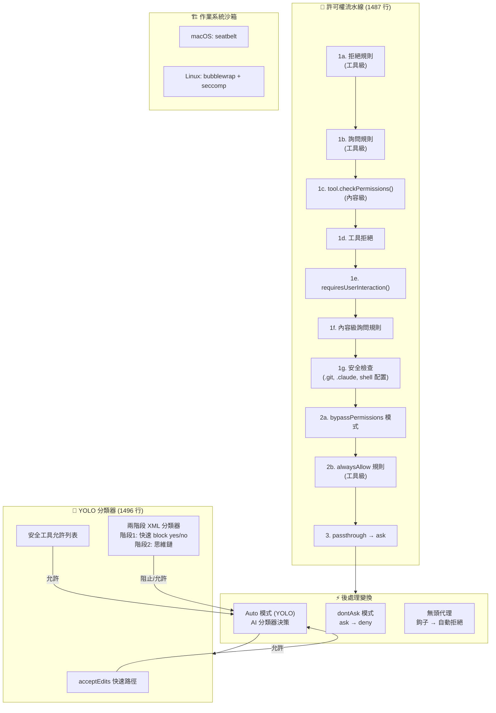
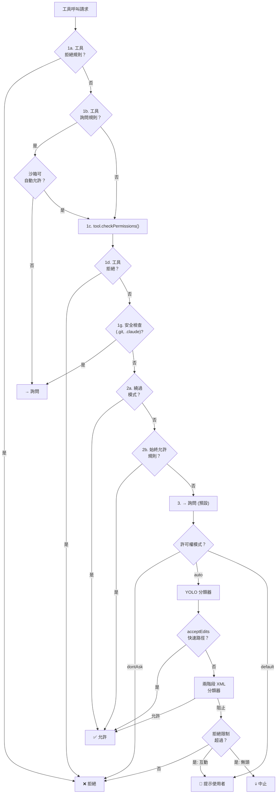

# 07 — 許可權流水線：從規則到核心的縱深防禦

> **範圍**: `utils/permissions/` (24 個檔案, ~320KB), `utils/settings/` (17 個檔案, ~135KB), `utils/sandbox/` (2 個檔案, ~37KB)
>
> **一句話概括**: Claude Code 如何決定一個工具呼叫的生死 —— 經過規則、分類器、鉤子和作業系統沙箱的七步考驗。

---

## 架構概覽



---

## 1. 七步考驗

核心函式 `hasPermissionsToUseToolInner()` 實現了一個**嚴格有序**的許可權評估流水線。每一步都可以短路整個鏈條：

### 步驟 1a：工具級拒絕規則

硬拒絕 —— 無法覆蓋。規則來源包括：`userSettings`、`projectSettings`、`localSettings`、`policySettings`、`flagSettings`、`cliArg`、`command`、`session`。

### 步驟 1b：工具級詢問規則

關鍵設計：當沙箱啟用並配置了自動允許時，沙箱化的 Bash 命令可以**跳過**詢問規則。非沙箱化命令（被排除的命令、`dangerouslyDisableSandbox`）仍然遵守規則。

### 步驟 1c：工具內容級許可權檢查

每個工具實現自己的 `checkPermissions()`。BashTool 檢查子命令，EditTool 檢查檔案路徑，WebFetch 驗證域名。

### 步驟 1d–1g：安全護欄

| 步驟 | 檢查 | 能否被繞過？ |
|------|------|------------|
| **1d** | 工具實現拒絕 | ❌ 不能 |
| **1e** | `requiresUserInteraction()` 返回 true | ❌ 不能 |
| **1f** | 內容級詢問規則（如 `Bash(npm publish:*)`） | ❌ 不能 |
| **1g** | 安全檢查（`.git/`、`.claude/`、`.vscode/`、shell 配置） | ❌ 不能 |

這四項檢查是**繞過免疫**的 —— 即使在 `bypassPermissions` 模式下也會觸發。

### 步驟 2a：繞過許可權模式

如果當前處於 `bypassPermissions` 模式（或 plan 模式但原始模式是 bypass），直接允許。

### 步驟 2b：始終允許規則

支援 MCP 伺服器級匹配：規則 `mcp__server1` 匹配 `mcp__server1__tool1`。

### 步驟 3：Passthrough → Ask

如果沒有任何決策，預設詢問使用者。

---

## 2. 六種許可權模式

| 模式 | `ask` 變為 | 安全檢查 | 說明 |
|------|-----------|---------|------|
| `default` | 提示使用者 | 提示 | 標準互動模式 |
| `plan` | 提示使用者 | 提示 | 暫存前置模式以便恢復 |
| `acceptEdits` | 允許（僅檔案編輯） | 提示 | 非編輯工具仍需提示 |
| `bypassPermissions` | 全部允許 | **仍然提示** | 可被 GrowthBook 門控或設定禁用 |
| `dontAsk` | **拒絕** | 提示 | 靜默拒絕，模型看到拒絕訊息 |
| `auto` | 分類器決策 | 提示 | 兩階段 XML 分類器，需門控 |

### 模式轉換

`transitionPermissionMode()` 集中處理所有副作用：

- **進入 auto 模式**：剝離危險許可權（`Bash(*)`、`python:*`、Agent 允許列表）—— 這些許可權會繞過分類器
- **離開 auto 模式**：恢復被剝離的許可權
- **進入 plan 模式**：儲存前置模式以便恢復
- **離開 plan 模式**：恢復之前的模式

---

## 3. 規則來源與層級

規則從 **7 個來源**載入：

| 來源 | 檔案 | 範圍 |
|------|------|------|
| `userSettings` | `~/.claude/settings.json` | 使用者全域性 |
| `projectSettings` | `.claude/settings.json` | 專案級，提交到倉庫 |
| `localSettings` | `.claude/settings.local.json` | 專案級，gitignore |
| `policySettings` | 企業 MDM 策略 | 組織範圍 |
| `flagSettings` | GrowthBook 功能標誌 | 遠端配置 |
| `cliArg` | `--allowed-tools`、`--disallowed-tools` | 單次呼叫 |
| `session` | 執行時透過許可權對話方塊新增 | 單次會話 |

### 規則格式

```
ToolName                  → 匹配整個工具
ToolName(content)         → 匹配帶特定內容的工具
Bash(npm test:*)          → Bash 命令的字首匹配
mcp__server1              → 匹配 MCP 伺服器的所有工具
Agent(Explore)            → 匹配特定代理型別
```

---

## 4. YOLO 分類器（Auto 模式）

當模式為 `auto` 時，`ask` 決策經過**三級快速路徑**系統後才到達 AI 分類器：

### 第一級：acceptEdits 快速路徑

以 `acceptEdits` 模式重新執行 `tool.checkPermissions()`。如果允許，跳過分類器。例外：`AgentTool` 和 `REPLTool` 被排除 —— REPL 程式碼可能包含 VM 逃逸。

### 第二級：安全工具允許列表

列入允許名單的工具完全跳過分類器。

### 第三級：兩階段 XML 分類器

分類器使用單獨的 LLM API 呼叫（`sideQuery`）和專用系統提示詞：

**階段 1（快速）**：max_tokens=64，引導立即給出 `<block>yes/no`。如果允許 → 結束。

**階段 2（思考）**：僅在階段 1 阻止時執行。使用思維鏈減少誤報。指令說明：*"審查分類過程... 覆蓋阻止需要顯式使用者確認。"*

### 分類器看到什麼

分類器看到的是**緊湊版記錄** —— 不是完整對話：

```jsonl
{"user":"修復登入bug"}
{"Bash":"ls src/"}
{"Read":"src/auth.ts"}
{"Bash":"npm test"}     ← 正在被分類的操作
```

關鍵安全設計：**助手文字被排除** —— 僅包含 tool_use 區塊。這防止模型構造影響分類器決策的誘導性文字。

### 危險許可權剝離

進入 auto 模式時，會繞過分類器的許可權被**剝離**：

- `Bash`（無內容）→ 允許所有命令
- `Bash(python:*)`、`Bash(node:*)` → 允許任意程式碼執行
- `PowerShell(iex:*)`、`PowerShell(Start-Process:*)` → 程式碼執行
- `Agent`（任何允許規則）→ 繞過子代理評估

被剝離的規則**暫存**到 `strippedDangerousRules`，離開 auto 模式時恢復。

---

## 5. 拒絕追蹤與熔斷器

### 連續拒絕限制

```typescript
// 原始碼位置: src/utils/permissions/denialTracking.ts:5-10
export const DENIAL_LIMITS = {
  maxConsecutive: 3,   // 連續 3 次阻止 → 回退到使用者提示
  maxTotal: 20,        // 單次會話總計 20 次阻止 → 回退
}
```

超過限制時：
- **互動模式**：回退到使用者提示
- **無頭模式**：丟擲 `AbortError` —— 會話終止

### 分類器故障模式

| 場景 | iron_gate = true（預設） | iron_gate = false |
|------|------------------------|-------------------|
| **API 錯誤** | 拒絕（失敗關閉） | 回退到使用者提示（失敗開放） |
| **記錄過長** | 無頭時中止；互動時提示 | 相同 |
| **無法解析響應** | 視為阻止 | 相同 |

`tengu_iron_gate_closed` 功能標誌控制失敗時關閉 vs. 開放行為，每 30 分鐘重新整理。

---

## 6. 無頭代理許可權

後臺/非同步代理無法顯示許可權提示。流水線的處理方式：

1. 執行 `PermissionRequest` 鉤子 —— 給鉤子機會做出決策
2. 如果沒有鉤子決策 → 自動拒絕

鉤子可以 `allow`（帶可選輸入修改）、`deny` 或 `interrupt`（中止整個代理）。

---

## 7. 沙箱整合

沙箱提供**核心級強制執行**，補充應用層許可權流水線：

### 沙箱自動允許

當 `autoAllowBashIfSandboxed` 啟用時：
1. 透過 `shouldUseSandbox()` 檢查的 Bash 命令 → **自動允許**（跳過 ask 規則）
2. OS 沙箱強制執行檔案系統和網路限制
3. 應用層檢查對沙箱化操作變得冗餘

### 沙箱保護範圍

| 保護 | 實現 |
|------|------|
| 檔案系統寫入 | `denyWrite` 列表（設定檔案、`.claude/skills`） |
| 檔案系統讀取 | `denyRead` 列表（敏感路徑） |
| 網路訪問 | 來自 WebFetch 規則的域名允許列表 |
| 裸 Git 倉庫攻擊 | 命令前後檔案清掃 |
| 符號連結追蹤 | `O_NOFOLLOW` 檔案操作 |
| 設定逃逸 | 無條件拒絕寫入 settings.json |

---

## 8. 完整決策流程



---

## 可遷移設計模式

> 以下模式可直接應用於其他 AI 智慧體許可權系統或安全流水線。

### 模式 1：有序流水線 + 繞過免疫安全檢查
**場景：** 不同規則源需要不同的覆蓋語義。
**實踐：** 將許可權評估結構化為嚴格有序的流水線，其中某些步驟對所有繞過模式免疫。
**Claude Code 中的應用：** 步驟 1d-1g 即使在 `bypassPermissions` 模式下也會觸發。

### 模式 2：分類器只看工具不看文字
**場景：** AI 安全分類器可能被模型自己的說服性輸出影響。
**實踐：** 從分類器輸入中剝除助手文字，僅包含結構化 tool_use 區塊。
**Claude Code 中的應用：** YOLO 分類器的記錄排除助手文字，防止社會工程攻擊。

### 模式 3：可逆許可權剝離
**場景：** 進入高自動化模式不應永久破壞手動許可權規則。
**實踐：** 進入模式時暫存被剝離的規則，退出時恢復。
**Claude Code 中的應用：** 危險的 `Bash(*)` 規則在進入 auto 模式時暫存，退出時恢復。

### 模式 4：拒絕熔斷器
**場景：** 被阻止的操作導致無限重試迴圈。
**實踐：** 追蹤連續和總計拒絕次數，超限後觸發回退。
**Claude Code 中的應用：** 連續 3 次或總計 20 次拒絕觸發模式回退。

---

## 10. OAuth 2.0 認證管道

**原始碼座標**: `src/services/oauth/client.ts`、`src/auth/`

許可權系統的權威性始於身份驗證。Claude Code 支援兩條認證路徑：

| 路徑 | 方法 | Token 型別 |
|------|------|-----------|
| **Console API Key** | `ANTHROPIC_API_KEY` 環境變數或配置 | 靜態金鑰，無過期管理 |
| **Claude.ai OAuth** | PKCE 授權碼流程 | JWT + 重新整理，~1h 過期 |

關鍵安全屬性：
- **PKCE (S256)**：防止授權碼攔截 —— `code_verifier` 在客戶端生成，直到交換時才傳送
- **Token 生命週期**：Access token ~1h 過期；Refresh token 儲存在 SecureStorage 中，自動在過期前重新整理
- **撤銷處理**：過期/已撤銷的 token 觸發重新認證，而非靜默失敗

### Token 重新整理排程

Bridge 會話使用 generation counter（代數計數器）防止過期重新整理競態，在過期前 5 分鐘排程重新整理，失敗最多重試 3 次。

---

## 11. Settings 多源合併系統

**原始碼座標**: `src/utils/settings/settings.ts`、`src/utils/settings/constants.ts`

許可權規則從五層設定系統載入（詳見第 16 篇），但許可權相關的特殊方面值得在此說明。

### 企業管控許可權

企業策略設定（`policySettings`）具有特殊屬性：它們**無法被**低優先順序來源覆蓋。當策略拒絕某工具時，任何專案或使用者設定都無法重新允許它。

### `disableBypassPermissionsMode` 設定

企業部署可以完全禁用繞過模式：

```typescript
permissions: {
  disableBypassPermissionsMode: 'disable',  // 完全移除該選項
  deny: [
    { tool: 'Bash', content: 'rm -rf:*' },  // 策略級拒絕
  ]
}
```

---

## 12. 安全憑證儲存

**原始碼座標**: `src/utils/secureStorage/`

### 平臺適配鏈

macOS 透過 `security` CLI 使用原生 Keychain，其他平臺優雅降級到明文儲存。

### Stale-While-Error 策略

憑證儲存韌性的最重要模式：當 `security` 子程序失敗時，繼續使用快取的成功資料而非返回 null。如果沒有這一策略，macOS Keychain Service 的臨時重啟會導致所有進行中的請求以"未登入"失敗。

### 4096 位元組 stdin 限制

macOS `security` 命令有一個未文件化的 stdin 限制（4096 位元組）。超過此限制會導致**靜默資料截斷** → 憑證損壞。這迫使設計選擇最小化儲存的憑證大小。

---

## 13. 元件總結

| 元件 | 行數 | 角色 |
|------|------|------|
| `permissions.ts` | 1,487 | 核心流水線：7步評估、模式變換 |
| `permissionSetup.ts` | 1,533 | 模式初始化、危險許可權檢測 |
| `yoloClassifier.ts` | 1,496 | auto 模式的兩階段 XML 分類器 |
| `PermissionMode.ts` | 142 | 6種許可權模式 + 配置 |
| `PermissionRule.ts` | 41 | 規則型別：`{toolName, ruleContent?}` |
| `denialTracking.ts` | 46 | 熔斷器：連續 3 次 / 總計 20 次 |
| `permissionRuleParser.ts` | ~200 | 規則字串 ↔ 結構化值轉換 |
| `permissionsLoader.ts` | ~250 | 從 7 個設定來源載入規則 |
| `shadowedRuleDetection.ts` | ~250 | 檢測衝突/遮蔽的規則 |
| `sandbox-adapter.ts` | 986 | OS 沙箱：seatbelt / bubblewrap |

許可權流水線是 Claude Code 架構最精密的子系統。其七步評估順序 —— 包含四項繞過免疫的安全檢查 —— 代表了關於 AI 代理執行任意程式碼時可能發生什麼的血淚教訓。YOLO 分類器的引入展示了系統從純規則匹配向 AI 輔助安全決策的演進，同時保留確定性護欄作為安全網。

---

**上一篇**: [← 06 — Bash 執行引擎](06-bash-engine.md)
