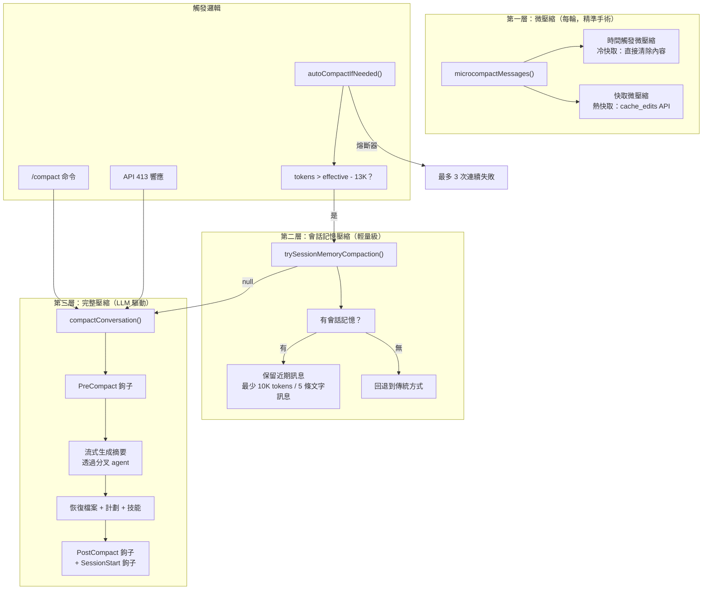

# 第十一集：壓縮系統 —— Claude Code 如何實現"無限"對話

> **原始檔**：`compact.ts`（1,706 行）、`autoCompact.ts`（352 行）、`microCompact.ts`（531 行）、`sessionMemoryCompact.ts`（631 行）、`prompt.ts`（375 行）、`grouping.ts`（64 行）、`postCompactCleanup.ts`（100 行）、`apiMicrocompact.ts`（140 行）、`compactWarningState.ts`（20 行）、`timeBasedMCConfig.ts`（49 行）
>
> **一句話總結**：Claude Code 的壓縮系統是一個多層記憶管理架構 —— 從精準的快取編輯刪除單個工具結果，到完整的 LLM 驅動對話摘要 —— 一切都是為了維持"無限上下文"的幻覺。

## 架構概覽



---

## 三層壓縮架構

Claude Code 採用分層策略管理上下文，每層在精度與壓縮率之間做不同權衡：

| 層級 | 機制 | 觸發條件 | 壓縮效果 | 快取影響 |
|------|------|----------|----------|----------|
| **微壓縮** | 清除舊工具結果 | 每輪（時間或數量觸發） | ~10-50K tokens | 保留（cache_edits）或重建（內容清除） |
| **會話記憶** | 用預建記憶替換舊訊息 | 自動壓縮閾值 | ~60-80% | 失效，但無需 LLM 呼叫 |
| **完整壓縮** | LLM 摘要整個對話 | 自動或手動 `/compact` | ~80-95% | 失效，消耗 1 次 API 呼叫 |

---

## 第一層：微壓縮 —— 精準的 Token 回收

微壓縮（`microCompact.ts`，531 行）在每一輪執行，精準地移除舊工具結果，不改變對話結構。

### 哪些工具會被壓縮？

```typescript
const COMPACTABLE_TOOLS = new Set([
  FILE_READ_TOOL_NAME,    // 檔案讀取
  ...SHELL_TOOL_NAMES,    // Bash、PowerShell
  GREP_TOOL_NAME,         // 搜尋內容
  GLOB_TOOL_NAME,         // 搜尋檔案
  WEB_SEARCH_TOOL_NAME,   // 網頁搜尋
  WEB_FETCH_TOOL_NAME,    // 網頁抓取
  FILE_EDIT_TOOL_NAME,    // 檔案編輯
  FILE_WRITE_TOOL_NAME,   // 檔案寫入
])
```

只針對高頻、可重現的工具結果。AgentTool、MCP 工具等的結果不會被壓縮。

### 兩條微壓縮路徑

**路徑 A：時間觸發微壓縮（冷快取）**

當距最後一條 assistant 訊息的時間超過閾值（伺服器快取已過期）時：

```typescript
function maybeTimeBasedMicrocompact(messages, querySource) {
  const trigger = evaluateTimeBasedTrigger(messages, querySource)
  // 如果間隔 > 閾值分鐘數，直接清除舊工具結果內容
  // 保留最近 N 個結果，其餘替換為 '[Old tool result content cleared]'
}
```

這是"暴力"路徑 —— 直接修改訊息內容，因為快取本來就是冷的。

**路徑 B：快取微壓縮（熱快取，Ant 內部）**

當伺服器快取仍然溫熱時，使用 `cache_edits` API 刪除工具結果而不使快取字首失效：

```typescript
// 不修改本地訊息 — cache_reference 和 cache_edits
// 在 API 層新增
const cacheEdits = mod.createCacheEditsBlock(state, toolsToDelete)
pendingCacheEdits = cacheEdits  // 由 API 層消費
```

核心洞察：快取微壓縮永遠不修改本地訊息。它把刪除指令排隊，由 API 層注入為 `cache_edits` 塊。伺服器從快取副本中移除工具結果，保持提示詞快取命中。

---

## 第二層：會話記憶壓縮 —— 走捷徑

會話記憶壓縮（`sessionMemoryCompact.ts`，631 行）是一個實驗性最佳化，跳過完整的 LLM 摘要呼叫。

### 工作原理

不再讓 LLM 摘要對話，而是使用**會話記憶**（由後臺 agent 持續維護的摘要）作為壓縮摘要。這消除了壓縮 API 呼叫的成本和延遲。

```
之前: [msg1, msg2, ..., msg_summarized, ..., msg_recent1, msg_recent2]
之後: [boundary, session_memory_summary, msg_recent1, msg_recent2]
```

### 訊息保留策略

```typescript
const DEFAULT_SM_COMPACT_CONFIG = {
  minTokens: 10_000,            // 至少保留 10K tokens
  minTextBlockMessages: 5,       // 至少保留 5 條含文字的訊息
  maxTokens: 40_000,            // 硬上限 40K tokens
}
```

從最後被摘要的訊息開始向前擴充套件，直到滿足兩個最低要求，不超過 `maxTokens`。

### API 不變數保護

最複雜的部分是 `adjustIndexToPreserveAPIInvariants()`（80+ 行），確保：

1. **工具對不被拆開**：保留範圍內的每個 `tool_result` 必須有匹配的 `tool_use`
2. **思考塊不被孤立**：如果 assistant 訊息共享同一 `message.id`（來自流式傳輸），所有相關訊息必須一起保留

---

## 第三層：完整壓縮 —— 核選項

`compactConversation()`（`compact.ts`，387-763 行）執行完整的 LLM 驅動對話摘要。

### 壓縮流水線

```
1. PreCompact 鉤子          — 讓擴充套件在壓縮前修改/檢查
2. stripImagesFromMessages() — 用 [image] 標記替換圖片
3. stripReinjectedAttachments() — 移除 skill_discovery/skill_listing
4. streamCompactSummary()    — 分叉 agent 生成摘要（帶 PTL 重試）
5. formatCompactSummary()    — 剝離 <analysis> 草稿本，保留 <summary>
6. 清除檔案狀態快取          — readFileState.clear()
7. 恢復壓縮後上下文：
   - 最近讀取的 5 個檔案（50K token 預算，每檔案 5K）
   - 已呼叫的技能（25K 預算，每技能 5K）
   - 活躍計劃內容
   - 計劃模式指令
   - 延遲工具增量
   - Agent 列表增量
   - MCP 指令增量
8. SessionStart 鉤子        — 如同啟動新會話一樣重新執行
9. PostCompact 鉤子         — 讓擴充套件響應壓縮
10. 重新追加會話後設資料       — 保持標題在 16KB 尾部視窗
```

### 摘要提示詞

壓縮提示詞（`prompt.ts`）指示模型生成結構化的 9 段摘要：

1. 主要請求與意圖
2. 關鍵技術概念
3. 檔案與程式碼段（含完整片段）
4. 錯誤與修復
5. 問題解決
6. 所有使用者訊息（對意圖追蹤至關重要）
7. 待辦任務
8. 當前工作
9. 可選下一步（含原文引用）

提示詞使用 `<analysis>` 草稿本塊，在最終摘要中被剝離 —— 一個"大聲思考"的空間，提高摘要質量而不消耗壓縮後的 token。

### 提示詞過長恢復（CC-1180）

當壓縮請求*本身*觸及 API 的提示詞過長限制時：

```typescript
for (;;) {
  summaryResponse = await streamCompactSummary(...)
  if (!summary?.startsWith(PROMPT_TOO_LONG_ERROR_MESSAGE)) break
  
  // 丟棄最早的 API 輪組直到覆蓋差距
  const truncated = truncateHeadForPTLRetry(messagesToSummarize, response)
  // 最多 3 次重試，每次從頭部丟棄更多
}
```

系統按 API 輪次（assistant message ID 邊界）分組訊息，然後丟棄最早的組直到覆蓋 token 差距。回退策略：當差距不可解析時丟棄 20% 的組。

---

## 自動壓縮觸發邏輯

`autoCompact.ts`（352 行）管理自動觸發壓縮。

### 閾值計算

```typescript
function getAutoCompactThreshold(model: string): number {
  const effectiveContextWindow = getEffectiveContextWindowSize(model)
  return effectiveContextWindow - AUTOCOMPACT_BUFFER_TOKENS  // - 13,000
}

function getEffectiveContextWindowSize(model: string): number {
  const contextWindow = getContextWindowForModel(model)
  const reserved = Math.min(getMaxOutputTokensForModel(model), 20_000)
  return contextWindow - reserved
}
```

以 200K 上下文模型為例：有效視窗 ≈ 180K，自動壓縮閾值 ≈ 167K tokens。

### 告警狀態機

```typescript
function calculateTokenWarningState(tokenUsage, model) {
  return {
    percentLeft,                    // 可視指示器
    isAboveWarningThreshold,        // 有效視窗 - 20K
    isAboveErrorThreshold,          // 有效視窗 - 20K
    isAboveAutoCompactThreshold,    // 有效視窗 - 13K
    isAtBlockingLimit,              // 有效視窗 - 3K（需手動壓縮）
  }
}
```

### 熔斷器

```typescript
const MAX_CONSECUTIVE_AUTOCOMPACT_FAILURES = 3
// BQ 2026-03-10：1,279 個會話有 50+ 次連續失敗
// 全球每天浪費約 250K 次 API 呼叫
```

連續 3 次失敗後，自動壓縮停止嘗試。這防止上下文不可恢復的會話持續錘擊 API。

### 遞迴防護

```typescript
if (querySource === 'session_memory' || querySource === 'compact') {
  return false  // 不要壓縮壓縮器本身
}
if (querySource === 'marble_origami') {
  return false  // 不要壓縮上下文摺疊 agent
}
```

---

## 訊息分組

`grouping.ts`（64 行）提供了在 API 輪次邊界分割對話的基本操作。

```typescript
function groupMessagesByApiRound(messages: Message[]): Message[][] {
  // 當新的 assistant 響應開始時觸發邊界
  // （與前一個 assistant 不同的 message.id）
  // 來自同一響應的流式塊共享 id → 同一組
}
```

這對兩個操作至關重要：
1. **PTL 重試截斷** — 丟棄最早的組以適配壓縮請求
2. **響應式壓縮** — API 的 413 響應觸發從尾部剝離的壓縮

---

## 部分壓縮

`partialCompactConversation()`（`compact.ts`，772 行）支援兩個方向：

| 方向 | 被摘要的部分 | 被保留的部分 | 快取影響 |
|------|-------------|-------------|----------|
| `'from'` | 樞軸點之後的訊息 | 更早的訊息 | **保留** — 保留的訊息是字首 |
| `'up_to'` | 樞軸點之前的訊息 | 更晚的訊息 | **失效** — 摘要在保留訊息之前 |

`'from'` 方向是快取友好的選擇：保留的（更早的）訊息的提示詞快取不受影響。

---

## 可遷移設計模式

> 以下模式可直接應用於其他 LLM 系統或上下文管理架構。

### 模式 1：多層壓縮流水線
**場景：** 增長的上下文視窗需要在不同緊迫程度下進行管理。
**實踐：** 分層設計精準（每輪）、輕量（預建摘要）和重量級（LLM 驅動）壓縮層，壓縮率和成本遞增。
**Claude Code 中的應用：** 微壓縮 → 會話記憶壓縮 → 完整壓縮。

### 模式 2：分析草稿本（注入前剝離）
**場景：** LLM 摘要任務受益於思維鏈，但輸出必須緊湊。
**實踐：** 提供 `<analysis>` 塊供模型思考，然後從最終輸出中剝離。
**Claude Code 中的應用：** `formatCompactSummary()` 在注入摘要前剝離 `<analysis>`。

### 模式 3：昂貴操作的熔斷器
**場景：** 反覆失敗的昂貴操作（API 呼叫）浪費資源。
**實踐：** 追蹤連續失敗次數，超過 N 次後停止重試。
**Claude Code 中的應用：** `MAX_CONSECUTIVE_AUTOCOMPACT_FAILURES = 3` 防止失控的 API 呼叫。

---

## 元件總結

| 元件 | 行數 | 職責 |
|------|------|------|
| `compact.ts` | 1,706 | 核心壓縮：完整壓縮、部分壓縮、PTL 重試、壓縮後恢復 |
| `sessionMemoryCompact.ts` | 631 | 會話記憶壓縮：訊息保留、API 不變數修復 |
| `microCompact.ts` | 531 | 微壓縮：快取 MC、時間觸發 MC、工具結果清除 |
| `prompt.ts` | 375 | 壓縮提示詞：9 段摘要模板、分析草稿本 |
| `autoCompact.ts` | 352 | 自動壓縮觸發：閾值計算、熔斷器、告警狀態 |
| `apiMicrocompact.ts` | 140 | API 層 cache_edits 整合 |
| `postCompactCleanup.ts` | 100 | 壓縮後快取重置和記憶檔案重新載入 |
| `grouping.ts` | 64 | 按 API 輪次邊界分組訊息 |
| `timeBasedMCConfig.ts` | 49 | 時間觸發 MC 配置（間隔閾值、保留數量） |
| `compactWarningState.ts` | 20 | 成功 MC 後的告警抑制狀態 |

---

*下一篇：[第十二集 — 啟動與引導 →](12-startup-bootstrap.md)*

[← 第十集 — 上下文裝配](10-context-assembly.md) | [第十二集 →](12-startup-bootstrap.md)
