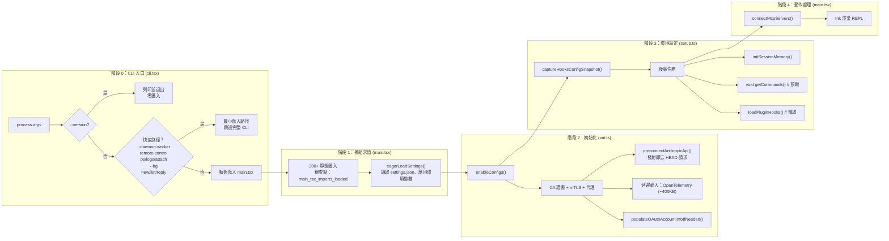

# 第十二集：啟動與引導 —— 從 `claude` 命令到第一個提示符

> **原始檔**：`cli.tsx`（303 行）、`init.ts`（341 行）、`setup.ts`（478 行）、`main.tsx`（4,500+ 行）、`bootstrap/state.ts`（1,759 行）、`startupProfiler.ts`（195 行）、`apiPreconnect.ts`（72 行）
>
> **一句話總結**：Claude Code 的啟動是一場精心編排的賽跑 —— 快速路徑級聯、動態匯入、並行預取和 API 預連線，一切都是為了讓使用者儘快開始輸入，同時將 400KB+ 的 OpenTelemetry、外掛和分析推遲到後臺。

## 架構概覽



---

## 階段 0：快速路徑級聯

`cli.tsx`（303 行）是真正的入口點。設計原則：**永遠不載入超過需要的內容**。

### 零匯入快速路徑

```typescript
// --version：零模組載入
if (args.length === 1 && (args[0] === '--version' || args[0] === '-v')) {
  console.log(`${MACRO.VERSION} (Claude Code)`)  // 構建時內聯的常量
  return
}
```

`MACRO.VERSION` 在構建時被內聯 —— 無匯入、無配置、無磁碟 I/O。

### 快速路徑層級

| 快速路徑 | 觸發條件 | 載入什麼 | 跳過什麼 |
|----------|----------|----------|----------|
| `--version` | `-v`、`--version` | 無 | 一切 |
| `--dump-system-prompt` | Ant 內部標誌 | `config.js`、`prompts.js` | UI、認證、分析 |
| `--daemon-worker` | 監督器生成 | 特定 worker 模組 | 配置、分析、sink |
| `remote-control` | `rc`、`remote`、`bridge` | Bridge + 認證 + 策略 | 完整 CLI、UI |
| `daemon` | `daemon` 子命令 | 配置 + sink + daemon | 完整 CLI、UI |
| `ps/logs/attach/kill` | 後臺會話管理 | 配置 + bg 模組 | 完整 CLI、UI |
| `new/list/reply` | 模板 | 模板處理器 | 完整 CLI |
| *(預設)* | 正常啟動 | `main.tsx`（所有內容） | 無 |

每個快速路徑都使用動態 `await import()`，模組樹僅在該路徑被選中時載入。

### 早期輸入捕獲

```typescript
// 在載入 main.tsx（觸發重量級模組求值）之前
const { startCapturingEarlyInput } = await import('../utils/earlyInput.js')
startCapturingEarlyInput()
```

在約 500ms 的模組求值視窗內緩衝按鍵，使用者可以在 REPL 就緒之前就開始輸入。

---

## 階段 1：模組求值

當 `main.tsx` 載入時，觸發 200+ 個靜態匯入的級聯求值。啟動分析器追蹤關鍵里程碑：

```typescript
// main.tsx 頂層
import { profileCheckpoint } from './utils/startupProfiler.js'
profileCheckpoint('main_tsx_entry')  // 重量級匯入之前

// ... 200+ 個匯入 ...

profileCheckpoint('main_tsx_imports_loaded')  // 所有匯入之後
```

### 設定引導

設定必須急切載入，因為它們影響模組級常量（例如 `DISABLE_BACKGROUND_TASKS` 在 BashTool 匯入時被捕獲）。

---

## 階段 2：初始化 (init.ts)

`init()`（341 行，記憶化 —— 只執行一次）處理與信任無關的設定：

### 執行順序

```
1. enableConfigs()                    — 驗證並啟用配置系統
2. applySafeConfigEnvironmentVariables() — 信任對話方塊之前應用安全環境變數
3. applyExtraCACertsFromConfig()      — 必須在第一次 TLS 握手之前執行
4. setupGracefulShutdown()            — 註冊 SIGINT/SIGTERM 處理器
5. initialize1PEventLogging()         — 延遲：OpenTelemetry sdk-logs
6. populateOAuthAccountInfoIfNeeded() — 非同步：填充 OAuth 快取
7. initJetBrainsDetection()           — 非同步：檢測 IDE
8. detectCurrentRepository()          — 非同步：填充 git 快取
9. configureGlobalMTLS()              — mTLS 證書配置
10. configureGlobalAgents()           — HTTP 代理 agent
11. preconnectAnthropicApi()          — 發射即忘 HEAD 請求
12. setShellIfWindows()               — Windows 上檢測 Git-bash
13. ensureScratchpadDir()             — 如果啟用則建立臨時目錄
```

### API 預連線

```typescript
// apiPreconnect.ts — 與啟動工作重疊 TCP+TLS 握手
export function preconnectAnthropicApi(): void {
  // 使用代理/mTLS/unix 套接字時跳過（SDK 使用不同的傳輸通道）
  // 使用 Bedrock/Vertex/Foundry 時跳過（不同的端點）

  const baseUrl = process.env.ANTHROPIC_BASE_URL || getOauthConfig().BASE_API_URL
  // 發射即忘 — 10 秒超時，錯誤靜默捕獲
  void fetch(baseUrl, {
    method: 'HEAD',
    signal: AbortSignal.timeout(10_000),
  }).catch(() => {})
}
```

TCP+TLS 握手消耗約 100-200ms。在 init 期間觸發它，使得預熱的連線在第一次 API 呼叫時就已就緒。Bun 的 fetch 全域性共享 keep-alive 連線池。

### 延遲遙測載入

```typescript
// OpenTelemetry 約 400KB + protobuf 模組
// gRPC 匯出器透過 @grpc/grpc-js 再新增約 700KB
// 全部延遲到遙測實際初始化時
const { initializeTelemetry } = await import('../utils/telemetry/instrumentation.js')
```

---

## 階段 3：環境設定 (setup.ts)

`setup()`（478 行）在信任建立之後執行，處理環境準備：

### 關鍵操作

1. **UDS 訊息伺服器** — Unix 域套接字程序間通訊（`--bare` 時跳過）
2. **Teammate 快照** — 捕獲 Swarm 隊友狀態（`--bare` 時跳過）
3. **終端備份恢復** — 檢測被中斷的 iTerm2/Terminal.app 設定
4. **CWD + 鉤子** — `setCwd()` 必須先執行，然後 `captureHooksConfigSnapshot()`
5. **Worktree 建立** — 如果有 `--worktree`，建立 git worktree 並切換到其中
6. **後臺任務** — 發射即忘預取

### 後臺預取策略

```typescript
// 後臺任務 — 只有關鍵註冊在首次查詢前完成
initSessionMemory()     // 同步 — 註冊鉤子，門控檢查延遲
void getCommands()      // 預取命令（與使用者輸入並行）
void loadPluginHooks()  // 預載入外掛鉤子

// 延遲到下一個 tick，git 子程序不阻塞首次渲染
setImmediate(() => {
  void registerAttributionHooks()
})
```

### `--bare` 模式

`--bare` 標誌（內部稱為 "SIMPLE"）短路了大量啟動邏輯：

| `--bare` 時跳過的 | 原因 |
|--------------------|------|
| UDS 訊息伺服器 | 指令碼呼叫不接收注入訊息 |
| Teammate 快照 | bare 模式無 Swarm |
| 終端備份檢查 | 非互動式 |
| 外掛預取 | `executeHooks` 在 `--bare` 下提前返回 |
| 歸屬鉤子 | 指令碼呼叫不提交程式碼 |
| 會話檔案訪問鉤子 | 不需要使用指標 |
| 團隊記憶監視器 | 指令碼模式無團隊記憶 |
| 釋出說明 | 非互動式 |

---

## Bootstrap 狀態單例

`bootstrap/state.ts`（1,759 行）是全域性狀態儲存 —— 會話級可變狀態存在的**唯一**地方。

### 設計約束

```typescript
// DO NOT ADD MORE STATE HERE - BE JUDICIOUS WITH GLOBAL STATE
// ALSO HERE - THINK THRICE BEFORE MODIFYING
// AND ESPECIALLY HERE
```

程式碼中有嚴厲的警告，因為它是依賴圖的葉節點 —— 每個模組都可以匯入它，但它幾乎不匯入任何東西。

### 關鍵狀態類別（80+ 個欄位）

| 類別 | 示例 | 生命週期 |
|------|------|----------|
| **身份** | `sessionId`、`originalCwd`、`projectRoot` | 會話 |
| **成本追蹤** | `totalCostUSD`、`totalAPIDuration`、`modelUsage` | 會話 |
| **輪次指標** | `turnToolDurationMs`、`turnHookCount` | 每輪（每次查詢重置） |
| **遙測** | `meter`、`sessionCounter`、`loggerProvider` | 延遲初始化 |
| **API 狀態** | `lastAPIRequest`、`lastMainRequestId` | 滾動更新 |
| **快取鎖存** | `afkModeHeaderLatched`、`fastModeHeaderLatched` | 粘性開啟（永不取消） |
| **功能狀態** | `invokedSkills`、`planSlugCache` | 會話 |

### 快取保護的粘性鎖存

```typescript
// 一旦 auto mode 被啟用，永遠傳送該 header
// Shift+Tab 切換不會導致 prompt cache 失效
afkModeHeaderLatched: boolean | null  // null = 尚未觸發, true = 已鎖存

// 一旦 fast mode 被啟用，保持傳送 header
// 冷卻進入/退出不會雙重導致快取失效
fastModeHeaderLatched: boolean | null
```

這些是"粘性開啟" —— 一旦設為 `true`，就永遠不會回到 `false`。這種模式防止了會話中功能切換導致的提示詞快取失效。

---

## 啟動效能分析器

`startupProfiler.ts`（195 行）為整個啟動路徑提供效能檢測。

### 兩種模式

| 模式 | 觸發方式 | 取樣率 | 輸出 |
|------|----------|--------|------|
| **取樣** | 始終（100% ant，0.5% 外部） | 每會話隨機 | Statsig `tengu_startup_perf` 事件 |
| **詳細** | `CLAUDE_CODE_PROFILE_STARTUP=1` | 100% | 帶記憶體快照的完整報告到 `~/.claude/startup-perf/` |

### 階段定義

```typescript
const PHASE_DEFINITIONS = {
  import_time: ['cli_entry', 'main_tsx_imports_loaded'],
  init_time: ['init_function_start', 'init_function_end'],
  settings_time: ['eagerLoadSettings_start', 'eagerLoadSettings_end'],
  total_time: ['cli_entry', 'main_after_run'],
}
```

### 檢查點時間線（正常啟動）

```
cli_entry                          →  t=0ms
cli_before_main_import             →  ~5ms（早期輸入緩衝建立）
main_tsx_entry                     →  ~10ms
main_tsx_imports_loaded            →  ~200-500ms（200+ 模組求值）
eagerLoadSettings_start            →  ~500ms
init_function_start                →  ~525ms
init_network_configured            →  ~540ms（mTLS + 代理）
init_function_end                  →  ~550ms
action_handler_start               →  ~650ms
action_tools_loaded                →  ~700ms
action_after_setup                 →  ~750ms
action_commands_loaded             →  ~800ms
action_mcp_configs_loaded          →  ~850ms
run_before_parse                   →  ~950ms
main_after_run                     →  ~1000ms（REPL 就緒）
```

---

## 可遷移設計模式

> 以下模式可直接應用於其他 CLI 工具或程序引導系統。

### 模式 1：動態匯入的快速路徑級聯
**場景：** CLI 工具有約 1 秒的啟動預算，但模組樹有 200+ 個檔案。
**實踐：** 使用動態 `await import()` 建立快速路徑級聯，每條路徑只載入所需模組。
**Claude Code 中的應用：** `--version` 載入 0 個匯入（約 5ms），`--daemon-worker` 載入約 10 個（約 50ms），正常啟動載入 200+（約 500-1000ms）。

### 模式 2：全域性狀態的 DAG 葉節點
**場景：** 全域性狀態單例如果從模組樹匯入，會導致迴圈依賴。
**實踐：** 讓狀態模組成為依賴圖的葉節點——幾乎不匯入任何東西，用 lint 規則強制執行。
**Claude Code 中的應用：** `bootstrap/state.ts` 僅匯入 `crypto`/`lodash`/`process`；ESLint `bootstrap-isolation` 規則阻止更深層匯入。

### 模式 3：預連線 vs 預取
**場景：** 啟動時需要預熱多種資源（網路、資料），但不能阻塞。
**實踐：** 分離 TCP+TLS 預連線（發射即忘 HEAD）和資料預取（發射即忘非同步呼叫），兩者均非阻塞。
**Claude Code 中的應用：** `preconnectAnthropicApi()` 在首次 API 呼叫時節省約 100-200ms；`void getCommands()` 並行預取資料。

---

## 元件總結

| 元件 | 行數 | 職責 |
|------|------|------|
| `main.tsx` | 4,500+ | 完整 CLI：commander 設定、動作處理器、REPL 編排 |
| `bootstrap/state.ts` | 1,759 | 全域性狀態單例：80+ 欄位、DAG 葉節點、粘性鎖存 |
| `setup.ts` | 478 | 信任後環境：worktree、鉤子、後臺預取 |
| `init.ts` | 341 | 與信任無關的初始化：配置、TLS、代理、預連線 |
| `cli.tsx` | 303 | 入口點：快速路徑級聯、動態匯入分發 |
| `startupProfiler.ts` | 195 | 啟動效能：檢查點、階段、記憶體快照 |
| `apiPreconnect.ts` | 72 | TCP+TLS 預熱：發射即忘 HEAD 請求到 Anthropic API |

---

*下一篇：[第十三集 — 橋接系統 →](13-bridge-system.md)*

[← 第十一集 — 壓縮系統](11-compact-system.md) | [第十三集 →](13-bridge-system.md)
